<h1 align="center">Legal Buddy</h1>

  An LLM-powered web application that helps justice-involved individuals understand their court cases,
  what’s happening now, and what typically comes next — using grounded data, visual explanations,
  and interactive procedural guidance.

<h2>Overview</h2>

  Legal Buddy is designed to reduce confusion and anxiety around legal proceedings by translating
  fragmented court records into clear explanations, visual summaries, and structured timelines.
  Rather than predicting outcomes, the system focuses on procedural clarity and historical patterns
  from similar cases.

<h2>Core Experiences</h2>

  Below are examples of key Legal Buddy workflows, including case entry, outcome statistics,
  timeline visualization, and procedural simulation.

<!-- ROW 1 -->

  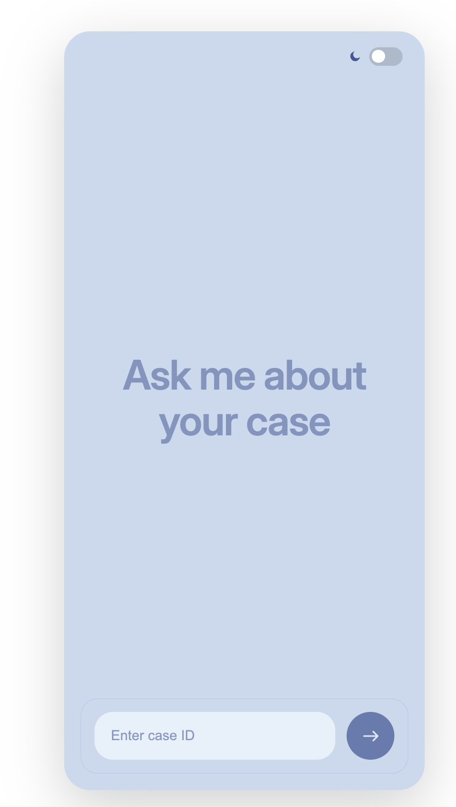

  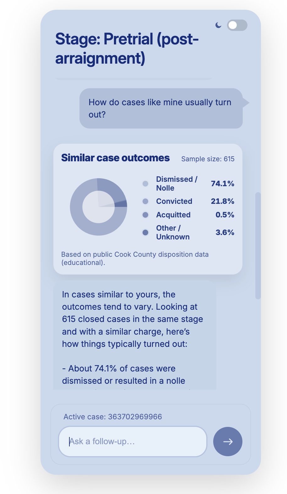

<!-- ROW 2 -->

  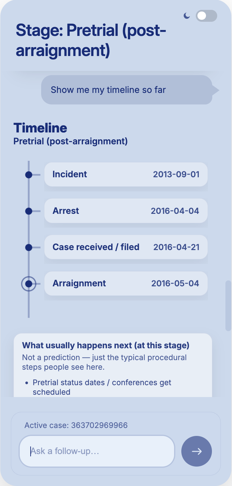

  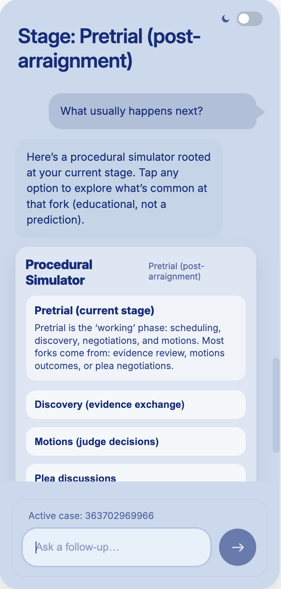

<h2>Case Overview (After Case ID Lookup)</h2>

  After a user submits a case ID, Legal Buddy retrieves relevant public court records and translates
  legal terminology and procedural status into clear, human-friendly language.

  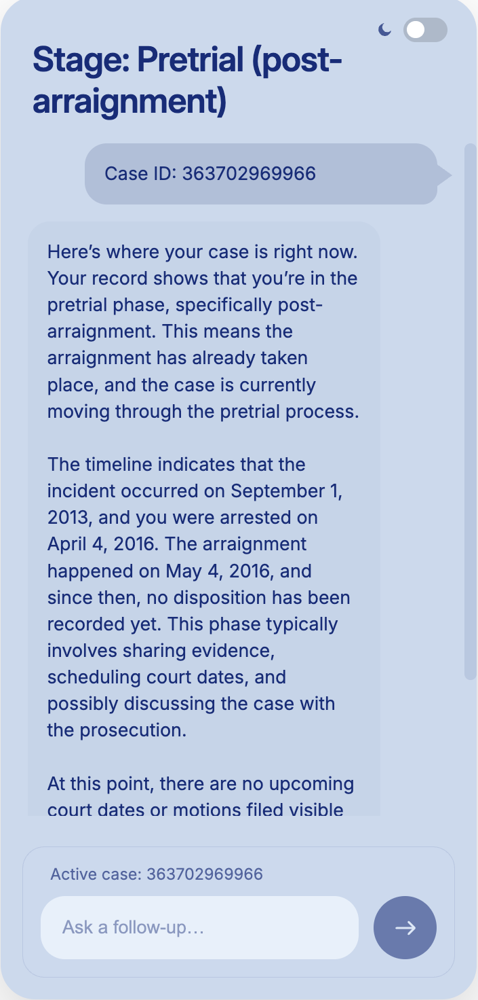

<h2>Similar Case Outcomes</h2>

  When users ask how similar cases typically turn out, Legal Buddy computes cohort-based outcome
  statistics and presents them visually alongside a plain-language explanation grounded in
  historical data.

  

  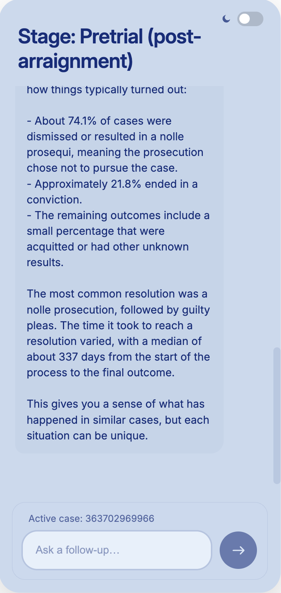

<h2>Procedural Simulator: “What Usually Happens Next?”</h2>

  Legal Buddy includes an interactive procedural simulator that allows users to explore common
  next steps in their case. This simulator reflects typical procedural paths rather than making
  individualized predictions.

  

  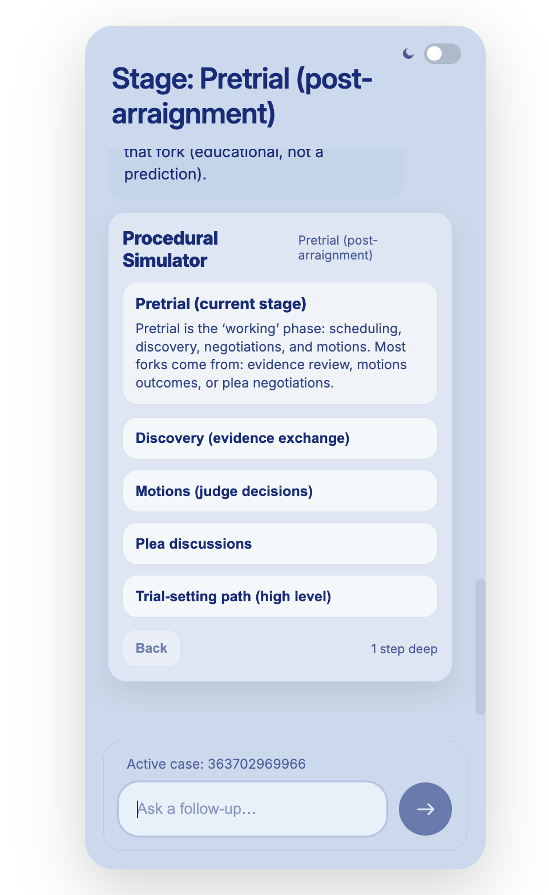

  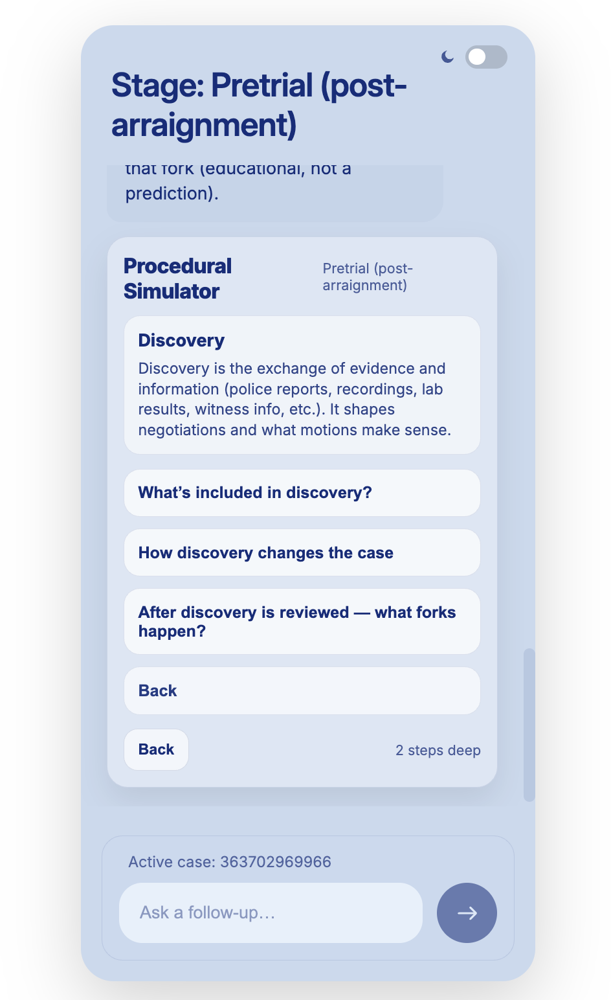

<h2>Case Timeline</h2>

  Users can view a structured timeline highlighting completed events, the current procedural stage,
  and likely upcoming milestones derived deterministically from court records.

  

  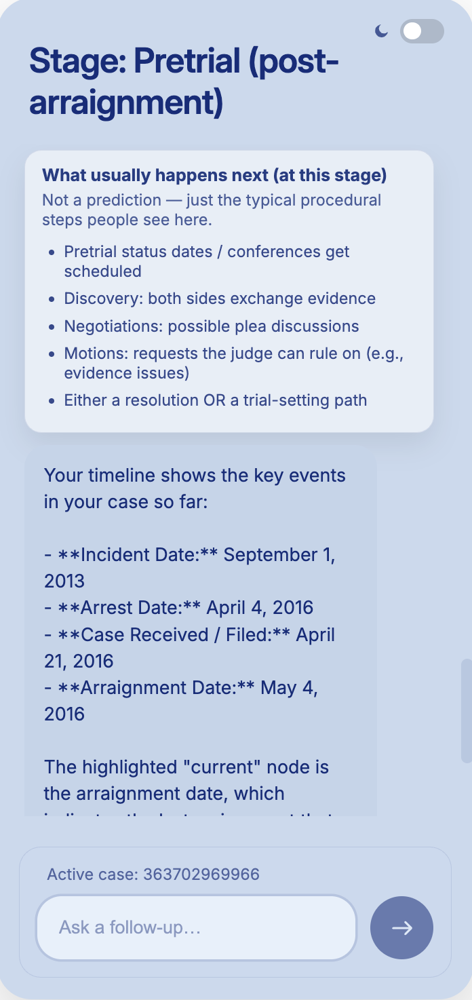

  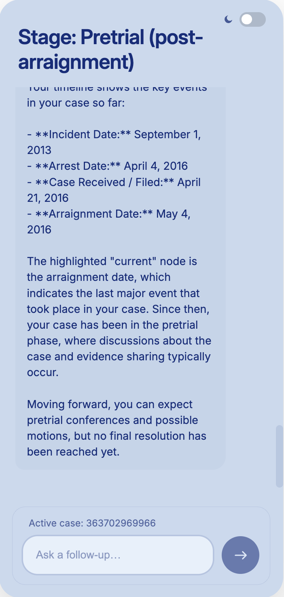

<h2>Dark Mode</h2>

  All major workflows support dark mode for accessibility and visual comfort.

<!-- DARK MODE ROW 1 -->

  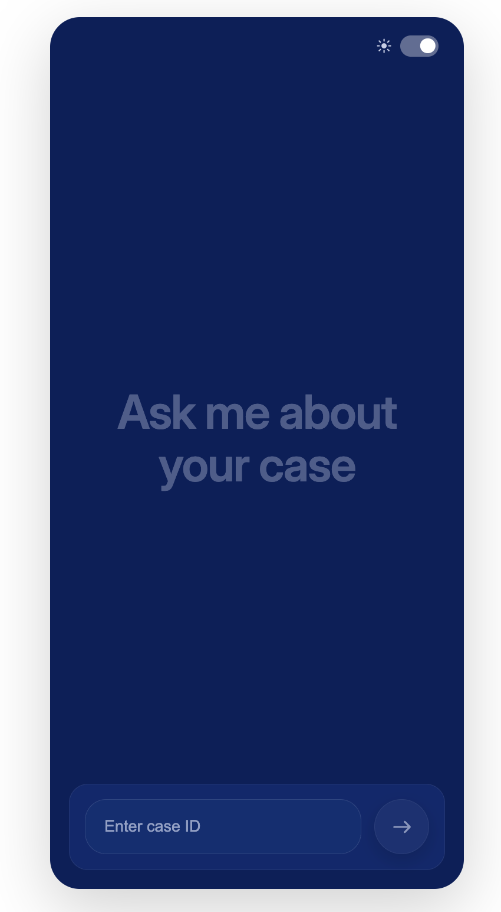

  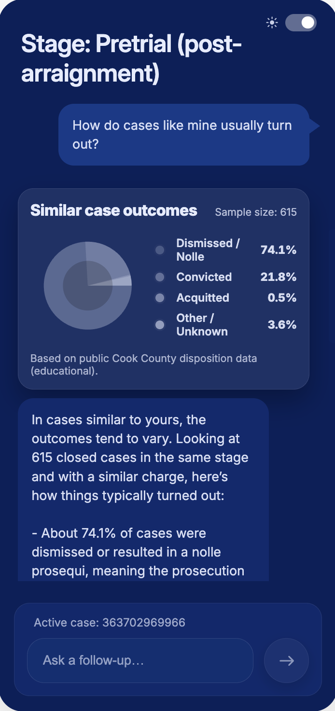

<!-- DARK MODE ROW 2 -->

  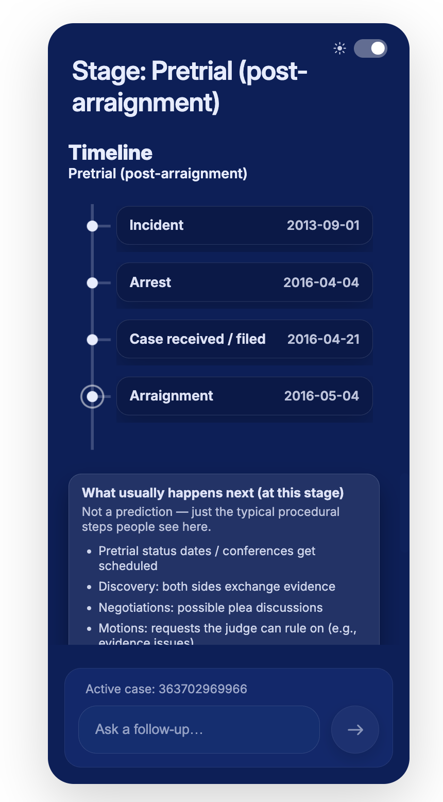

  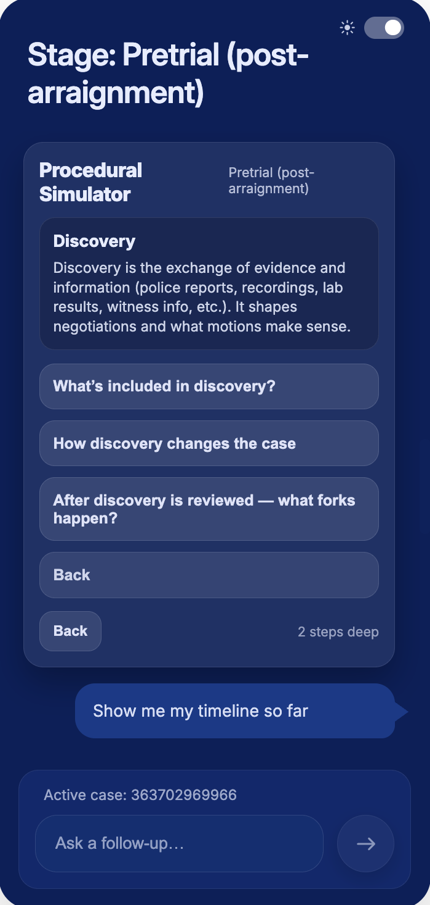

<h2>Key Features</h2>

<ul>
  <li>Grounded retrieval of public court records</li>
  <li>Plain-language explanations of legal status and procedure</li>
  <li>Visual outcome statistics for similar cases</li>
  <li>Interactive procedural simulator</li>
  <li>Deterministic case timeline generation</li>
  <li>Light and dark mode support</li>
</ul>

<h2>Tech Stack</h2>

<ul>
  <li><strong>Frontend:</strong> React</li>
  <li><strong>Backend:</strong> FastAPI</li>
  <li><strong>LLMs:</strong> OpenAI and local models</li>
  <li><strong>Data:</strong> Public court records</li>
</ul>

  This project was built with a focus on clarity, accessibility, and procedural justice.

